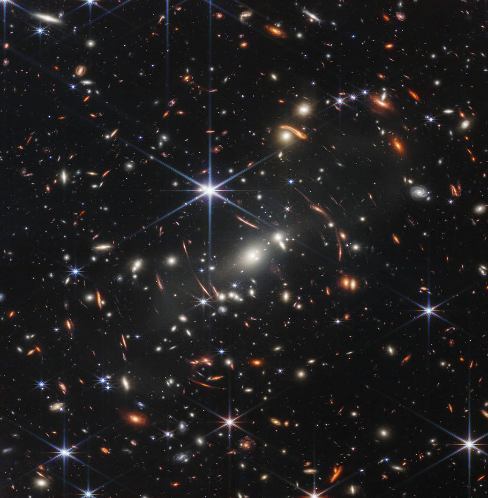

# Stellar Classification




## Objetivo do projeto: 

Este projeto tem como objetivo desenvolver um modelo de classificação de corpos celestes utilizando uma Rede Neural Multilayer Perceptron (MLP). O modelo é treinado e avaliado sobre um dataset de classificação estelar. 

## Dataset:

[Clique aqui para acessar](https://www.kaggle.com/datasets/fedesoriano/stellar-classification-dataset-sdss17)


## Criação de um ambiente virtual:


### Criação da venv
```bash
python -m venv .venv
```

### Ativação do ambiente
```bash
source .venv/bin/activate
```
### Desativação do ambiente:
```bash
deactivate
```

## Instalar dependências

```bash
pip install -r requirements.txt.
```

## Desenvolvedor

Eduardo Nogueira da Silva

